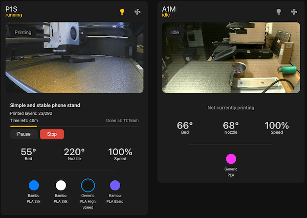
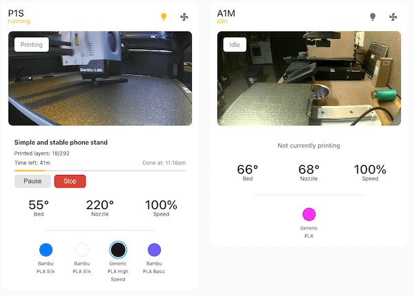

After setting up my Bambu Lab printer with Home Assistant, I found myself wanting a better way to monitor prints than constantly opening the Handy app which sends data through the cloud and is VERY laggy. I was getting "printe complete" notifications from the app 8 hours after the print finished! While existing printer cards were functional, they didn't quite give me the all-in-one minimal and clean view I wanted. So, I built PrintWatch - a custom Home Assistant card that brings all your printer's vital stats into one clean interface.



## What Makes PrintWatch Special?

[PrintWatch](https://github.com/drkpxl/printwatch-card) is designed to give you everything you need at a glance:

- 🎥 Live camera feed with print status overlay
- 🌡️ Real-time temperature monitoring for bed and nozzle
- 📊 Print progress tracking with layer counts
- 🎨 AMS/Material status visualization
- 💡 Quick controls for chamber light and auxiliary fan
- ⏯️ Print control buttons with confirmation dialogs
- 🌑 Dark mode support

## Getting Started

### Prerequisites

Before we dive in, make sure you have:

1. Home Assistant up and running
2. [Bambu Labs Add-on](https://github.com/greghesp/ha-bambulab) installed and configured
3. "Use image sensor camera" enabled for your printer configured in the BambuLab device settings

### Installation

The easiest way to install PrintWatch is through HACS:

1. Open HACS in Home Assistant
2. Click on "Frontend"
3. Click the "+ Explore & Download Repositories" button
4. Search for "PrintWatch Card"
5. Click "Download"
6. Restart Home Assistant

### Basic Configuration

Add the card to your dashboard with this simple configuration:

```yaml
type: custom:printwatch-card
printer_name: P1S
camera_refresh_rate: 1000
print_status_entity: sensor.p1s_print_status
current_stage_entity: sensor.p1s_current_stage
task_name_entity: sensor.p1s_task_name
progress_entity: sensor.p1s_print_progress
current_layer_entity: sensor.p1s_current_layer
total_layers_entity: sensor.p1s_total_layer_count
remaining_time_entity: sensor.p1s_remaining_time
bed_temp_entity: sensor.p1s_bed_temperature
nozzle_temp_entity: sensor.p1s_nozzle_temperature
speed_profile_entity: sensor.p1s_speed_profile
camera_entity: image.p1s_camera
```



## Features in Detail

### Smart Controls

The card includes safety features like confirmation dialogs for pause/stop actions - because we've all accidentally hit that stop button at least once! The chamber light and auxiliary fan can be toggled directly from the card.

### Material Tracking

If you're using an AMS, the card shows all four slots with their current materials and colors. It even highlights which slot is active during printing.

### Dark Mode

For the dark mode lover, PrintWatch includes full Home Assistant support that respects your Home Assistant theme settings.

### What's Next?

I'm actively working on new features and improvements. Some things in the pipeline:

- G-code preview integration
- Print time estimations using machine learning
- Custom notification triggers
- Mobile-optimized layout improvements

## Wrap Up

[PrintWatch](https://github.com/drkpxl/printwatch-card) is my attempt to make monitoring Bambu Lab printers in Home Assistant more intuitive and comprehensive. It's open source and available on my GitHub if you want to contribute or suggest improvements.

As always, if you have any questions, hit me up on [Blue Sky](https://bsky.app/profile/drkpxl.com) and I'll do my best to help out!
